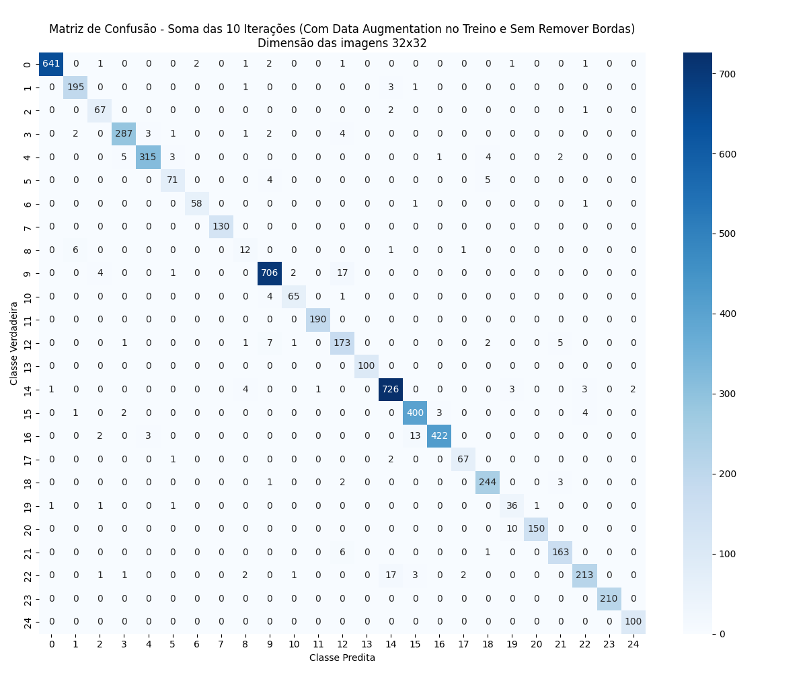
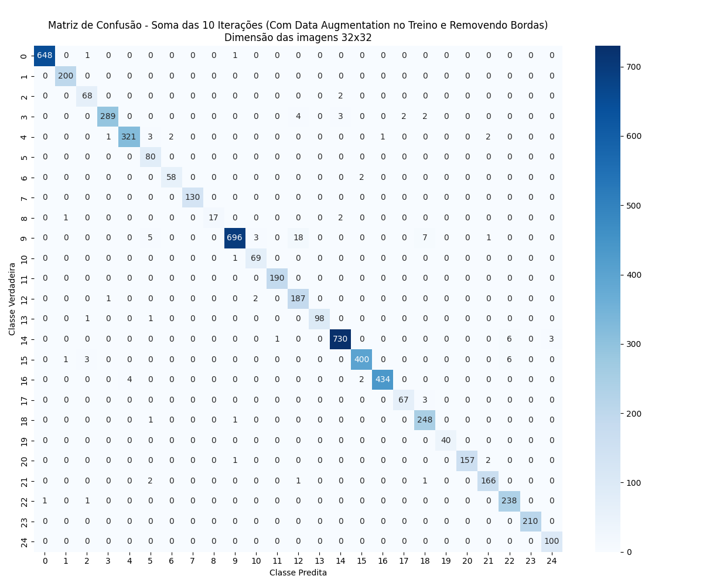

# K-Nearest Neighbors para OCR

Neste projeto, utilizamos o algoritmo <strong>k-Nearest Neighbors (k-NN)</strong> para realizar o reconhecimento automático de caracteres do alfabeto Iorubá a partir de imagens pré-processadas. Esse processo se enquadra no contexto de <strong>OCR (<em>Optical Character Recognition</em>)</strong>, onde o objetivo é identificar o caractere representado pela imagem. O k-NN foi escolhido por ser um método simples, interpretável e eficiente em problemas de classificação baseados em similaridade.

## Participantes

Artur Massaro Cremonez  
Bruno Henrique Silva Viola

---

## O que foi feito?

Iniciamos pelo pré-processamento, realizando a conversão das imagens para a escala de cinza. Construímos a possibilidade de recorte das bordas brancas dos caracteres (essa opção deve ser ativada por uma flag). Por fim, executamos o redimensionamento das imagens para `32x32` pixels.

---

## Estrutura do Repositório

Outros experimentos foram realizados com diferentes resoluções de imagem (`16x16`, `64x64`, `128x128`, etc.). Os resultados podem ser encontrados nas pastas:

- 📁 `matrizes_de_confusao/`
- 📁 `metricas_por_classe/`
- 📁 `relatorios_classificacao/`

---

## Metodologia

- 🔍 Algoritmo: `KNeighborsClassifier` com `k=5`
- 🔁 Execução em **10 iterações** com seeds diferentes
- 🔀 Divisão dos dados: **80% treino / 20% teste**
- 📉 Imagens achatadas (`flatten`) para entrada no modelo

Métricas de Avaliação: Foram avaliadas duas categorias de métricas.

- 📊 **Métricas gerais (médias ao final das 10 iterações):**
  - Acurácia
  - Precisão
  - Revocação
  - F1-Score

- 📈 **Métricas por classe:**
  - Precisão por classe
  - Revocação por classe
  - F1-Score por classe

---

## Pipeline

### ▶️ Pré-processamento

- Conversão para escala de cinza
- Possibilidades:
  - Adequação de cores
  - Adequação de dimensões
  - Balanceamento entre as classes (via data augmentation)
  - Estruturação dos dados por classe

### ▶️ Treinamento/Teste

- Execução do KNN por 10 iterações
- Registro de métricas por iteração e por classe
- Salvar arquivos com resultados em `.txt`, `.png`, etc.

### ▶️ Pós-processamento

- Geração de gráficos e matrizes de confusão acumuladas
- Nomeação dos arquivos com tags indicando as configurações (e.g., `COM_DataAug`, `Bordas_REMOVIDAS`)

---

## Resultados

### 📌 Cenário 1: **Sem Data Augmentation, Sem Recorte de Bordas**

- 📝 [`relat_32x32_SEM_DataAug_Bordas_NAO_REMOVIDAS.txt`](relatorios_classificacao/relat_32x32_SEM_DataAug_Bordas_NAO_REMOVIDAS.txt)  
- 📊 Matriz de confusão:  
- 📈 Métricas por classe:

| Métricas (após 10 iterações) | Valor   |
|------------------------------|---------|
| Acurácia média               | 0.9434  |
| Precisão média               | 0.9139  |
| Revocação média              | 0.8620  |
| F1-Score médio               | 0.8801  |

---

### 📌 Cenário 2: **Com Data Augmentation, Sem Recorte de Bordas**

#### Data Augmentation

Para lidar com desbalanceamento entre classes, aplicamos transformações aleatórias no conjunto de treino:

- 🔄 Rotação aleatória entre -10° e +10°  
- 💡 Brilho entre 0.5 e 1.5  
- 🎚️ Contraste entre 0.5 e 1.5  
- ✨ Nitidez entre 0.5 e 1.5  

Objetivo: garantir **300 exemplos por classe**.

- 📝 [`relat_32x32_COM_DataAug_Bordas_NAO_REMOVIDAS.txt`](relatorios_classificacao/relat_32x32_COM_DataAug_Bordas_NAO_REMOVIDAS.txt)  
- 📊 Matriz de confusão:  
- 📈 Métricas por classe:

| Métricas (após 10 iterações) | Valor  | Ganho/Perda em relação ao cenário 1 |
|------------------------------|--------|-------------------------------------|
| Acurácia média               | 0.9649 | + 0.0215                            |
| Precisão média               | 0.9409 | + 0.0270                            |
| Revocação média              | 0.9449 | + 0.0829                            |
| F1-Score médio               | 0.9395 | + 0.0594                            |

---

### 📌 Cenário 3: **Com Data Augmentation e Recorte de Bordas**

- 📝 [`relat_32x32_COM_DataAug_Bordas_REMOVIDAS.txt`](relatorios_classificacao/relat_32x32_COM_DataAug_Bordas_REMOVIDAS.txt)  
- 📊 Matriz de confusão:  
- 📈 Métricas por classe:

| Métricas (após 10 iterações) | Valor  | Ganho/Perda em relação ao cenário 2 |
|------------------------------|--------|---------------------------|
| Acurácia média               | 0.9817 | + 0.0168                  |
| Precisão média               | 0.9746 | + 0.0337                  |
| Revocação média              | 0.9789 | + 0.0340                  |
| F1-Score médio               | 0.9748 | + 0.0353                  |

---

## Conclusão

Mesmo com um classificador simples como o KNN, obtivemos ótimos resultados no reconhecimento de caracteres iorubás. As técnicas aplicadas no pré-processamento tiveram papel fundamental no desempenho do modelo.

A combinação de **data augmentation** com **recorte das bordas** resultou no melhor cenário testado, atingindo uma acurácia média de **98.17%**. Esses resultados demonstram que o cuidado com o tratamento das imagens pode ser tão ou mais importante que a escolha do algoritmo em si, especialmente em tarefas de classificação visual com dados desbalanceados.

Além disso, foi possível observar que letras com poucos exemplos, que inicialmente não eram reconhecidas, passaram a ser corretamente classificadas com o uso do **data augmentation** e melhoraram ainda mais após o recorte das bordas. Isso reforça a importância dessas etapas para garantir que todas as classes sejam representadas e avaliadas de forma justa.

---

