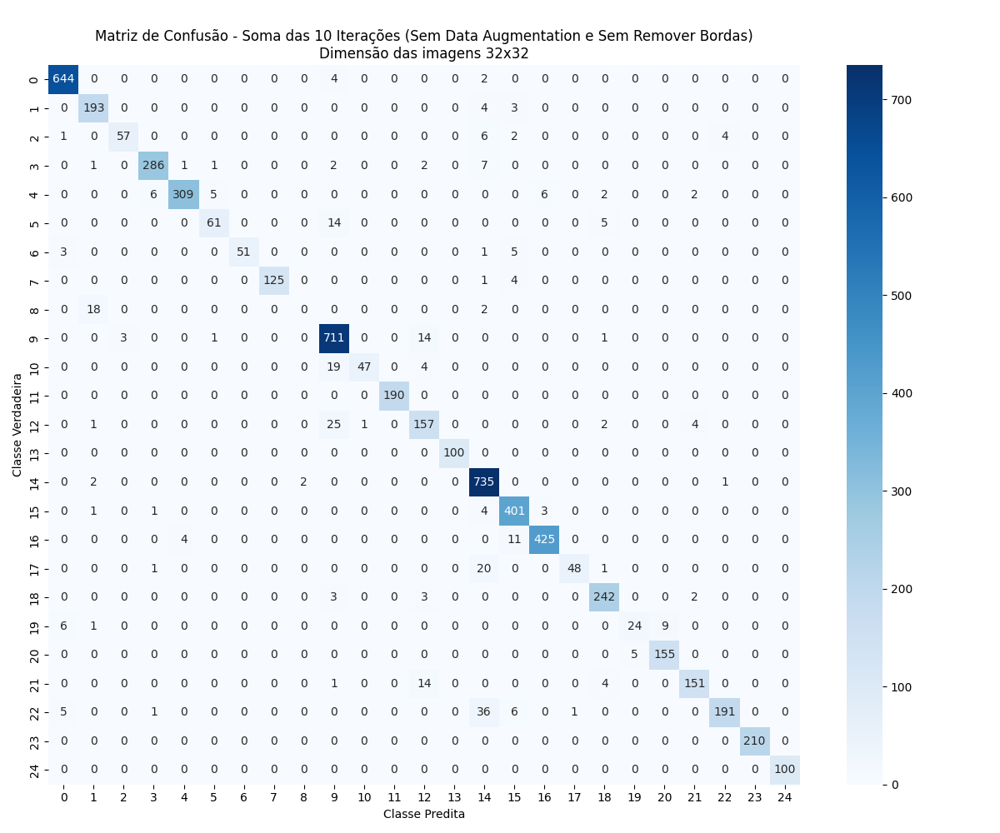
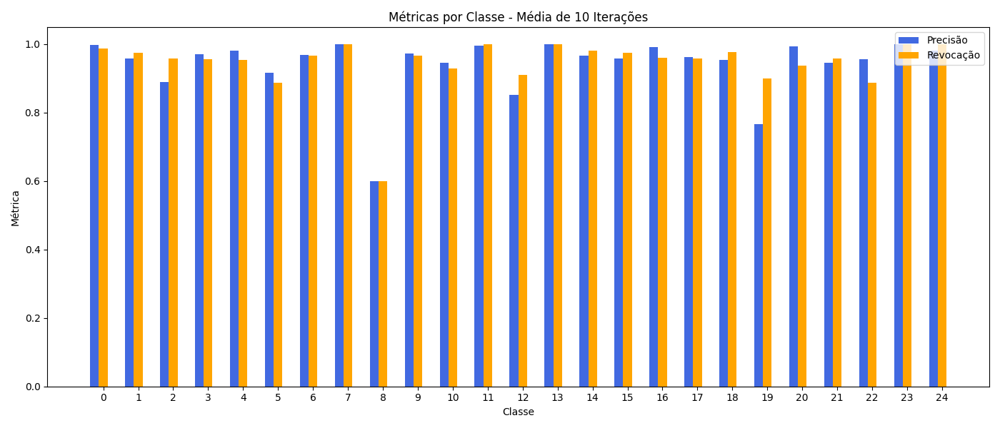

# K-Nearest Neighbors for OCR

In this project, we use the <strong>k-Nearest Neighbors (k-NN)</strong> algorithm to perform automatic recognition of characters from the Yoruba alphabet based on preprocessed images. This process falls within the context of <strong>OCR (<em>Optical Character Recognition</em>)</strong>, where the goal is to identify the character represented by an image. KNN was chosen for being a simple, interpretable, and effective method for similarity-based classification problems.

## Participants

Artur Massaro Cremonez  
Bruno Henrique Silva Viola

---

## What was done?

We started with image preprocessing, converting the images to grayscale. We implemented an option to crop the white borders around the characters (this option can be enabled via a flag). Finally, the images were resized to `32x32` pixels.

---

## Repository Structure

Additional experiments were carried out using different image resolutions (`16x16`, `64x64`, `128x128`, etc.). The results can be found in the following folders:

- 📁 `matrizes_de_confusao/`
- 📁 `metricas_por_classe/`
- 📁 `relatorios_classificacao/`

---

## Methodology

- 🔍 Algorithm: `KNeighborsClassifier` with `k=5`
- 🔁 Execution over **10 iterations** using different random seeds
- 🔀 Data split: **80% training / 20% testing**
- 📉 Images flattened before being fed into the model

### Evaluation Metrics

Two categories of metrics were evaluated:

- 📊 **Overall metrics (averaged after 10 iterations):**
  - Accuracy
  - Precision
  - Recall
  - F1-Score

- 📈 **Per-class metrics:**
  - Precision per class
  - Recall per class
  - F1-Score per class

---

## Pipeline

### ▶️ Preprocessing

- Conversion to grayscale
- Options:
  - Color normalization
  - Dimension normalization
  - Class balancing (via data augmentation)
  - Data organization by class

### ▶️ Training / Testing

- Execution of KNN over 10 iterations
- Recording metrics per iteration and per class
- Saving result files in `.txt`, `.png`, etc.

### ▶️ Post-processing

- Generation of accumulated plots and confusion matrices
- File naming with tags indicating the configuration used (e.g., `COM_DataAug`, `Bordas_REMOVIDAS`)

---

## Results

### 📌 Scenario 1: **Without Data Augmentation, Without Border Cropping**

- 📝 [`relat_32x32_SEM_DataAug_Bordas_NAO_REMOVIDAS.txt`](relatorios_classificacao/relat_32x32_SEM_DataAug_Bordas_NAO_REMOVIDAS.txt)  
- 📊 Confusion matrix:  
    
- 📈 Per-class metrics:  
  

| Metrics (after 10 iterations) | Value  |
|-------------------------------|--------|
| Average accuracy              | 0.9434 |
| Average precision             | 0.9139 |
| Average recall                | 0.8620 |
| Average F1-score              | 0.8801 |

---

### 📌 Scenario 2: **With Data Augmentation, Without Border Cropping**

#### Data Augmentation

To address class imbalance, random transformations were applied to the training set:

- 🔄 Random rotation between -10° and +10°  
- 💡 Brightness adjustment between 0.5 and 1.5  
- 🎚️ Contrast adjustment between 0.5 and 1.5  
- ✨ Sharpness adjustment between 0.5 and 1.5  

Objective: ensure **300 samples per class**.

- 📝 [`relat_32x32_COM_DataAug_Bordas_NAO_REMOVIDAS.txt`](relatorios_classificacao/relat_32x32_COM_DataAug_Bordas_NAO_REMOVIDAS.txt)  
- 📊 Confusion matrix:  
    
- 📈 Per-class metrics:  
  

| Metrics (after 10 iterations) | Value  | Gain/Loss compared to Scenario 1 |
|-------------------------------|--------|----------------------------------|
| Average accuracy              | 0.9649 | + 0.0215                         |
| Average precision             | 0.9409 | + 0.0270                         |
| Average recall                | 0.9449 | + 0.0829                         |
| Average F1-score              | 0.9395 | + 0.0594                         |

---

### 📌 Scenario 3: **With Data Augmentation and Border Cropping**

- 📝 [`relat_32x32_COM_DataAug_Bordas_REMOVIDAS.txt`](relatorios_classificacao/relat_32x32_COM_DataAug_Bordas_REMOVIDAS.txt)  
- 📊 Confusion matrix:  
    
- 📈 Per-class metrics:  
  

| Metrics (after 10 iterations) | Value  | Gain/Loss compared to Scenario 2 |
|-------------------------------|--------|----------------------------------|
| Average accuracy              | 0.9817 | + 0.0168                         |
| Average precision             | 0.9746 | + 0.0337                         |
| Average recall                | 0.9789 | + 0.0340                         |
| Average F1-score              | 0.9748 | + 0.0353                         |

---

## Conclusion

Even with a simple classifier such as KNN, we achieved excellent results in the recognition of Yoruba characters. The preprocessing techniques played a fundamental role in the model’s performance.

The combination of **data augmentation** and **border cropping** produced the best tested scenario, achieving an average accuracy of **98.17%**. These results demonstrate that careful image preprocessing can be as important as — or even more important than — the choice of the algorithm itself, especially in visual classification tasks with imbalanced data.

Additionally, characters with few original samples, which were initially not recognized, became correctly classified after applying **data augmentation**, and their performance improved even further after border cropping. This reinforces the importance of these steps to ensure that all classes are fairly represented and properly evaluated.

---
